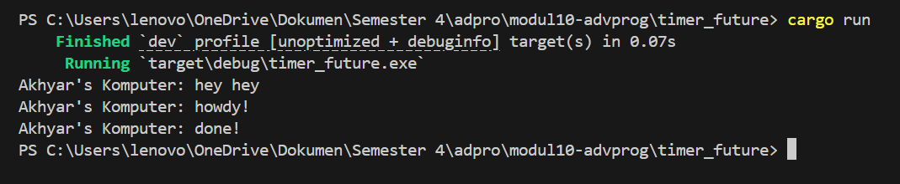

Advance Programming
# Module 10 - Asynchronous Programming (timer) 📘

- Nama    : Akhyar Rasyid Asy syifa
- Kelas   : Advance Programming - A
- NPM     : 2306241682

## Reflection

setelah menambahkan pesan baru, yaitu `println!("Akhyar's Komputer: hey hey");` lalu dilakukan cargo run, maka yang akan terprint lebih dulu adalah Akhyar's Komputer: hey hey. Pesan ini muncul lebih dulu karena berada langsung di fungsi `main()` yang dieksekusi secara sinkron. Baru setelah itu diikuti Akhyar's Komputer: howdy! dan Akhyar's Komputer: done! dicetak dari sebuah _async task_ yang dijalankan secara terpisah oleh _spawner_ dan _executor_. Proses _async_ ini berjalan secara non-blocking, sehingga program utama tidak menunggu tugas _async_ selesai sebelum melanjutkan eksekusi. Saat pesan "Akhyar's Komputer: howdy!" sudah tercetak, eksekusi _async_ dihentikan sementara oleh `TimerFuture::new(Duration::new(2, 0)).await` selama 2 detik, kemudian dilanjutkan kembali untuk mencetak "Akhyar's Komputer: done!".