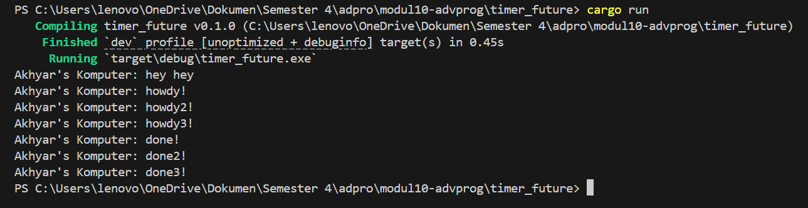
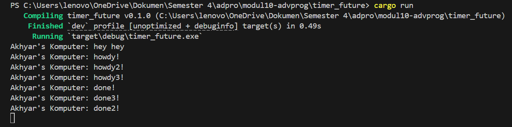

Advance Programming
# Module 10 - Asynchronous Programming (timer) 📘

- Nama    : Akhyar Rasyid Asy syifa
- Kelas   : Advance Programming - A
- NPM     : 2306241682

## Reflection

setelah menambahkan pesan baru, yaitu `println!("Akhyar's Komputer: hey hey");` lalu dilakukan cargo run, maka yang akan terprint lebih dulu adalah Akhyar's Komputer: hey hey. Pesan ini muncul lebih dulu karena berada langsung di fungsi `main()` yang dieksekusi secara sinkron. Baru setelah itu diikuti Akhyar's Komputer: howdy! dan Akhyar's Komputer: done! dicetak dari sebuah _async task_ yang dijalankan secara terpisah oleh _spawner_ dan _executor_. Proses _async_ ini berjalan secara non-blocking, sehingga program utama tidak menunggu tugas _async_ selesai sebelum melanjutkan eksekusi. Saat pesan "Akhyar's Komputer: howdy!" sudah tercetak, eksekusi _async_ dihentikan sementara oleh `TimerFuture::new(Duration::new(2, 0)).await` selama 2 detik, kemudian dilanjutkan kembali untuk mencetak "Akhyar's Komputer: done!".

di gambar tersebut terlihat bahwa "hey hey" muncul pertama seperti sebelumnya, Sedangkan task-task async seperti "howdy!", "howdy1!", "howdy2!" dan "done!", "done1!", "done!3" dijalankan oleh executor secara concurrent setelah disediakan oleh spawner. Ketika ada banyak spawn, semua task langsung dimasukkan ke dalam antrean dan dijalankan hampir bersamaan. Maka, semua pesan "howdy!", "howdy2!", dan "howdy3!" muncul lebih dulu, lalu setelah jeda 2 detik (karena `TimerFuture::new(Duration::new(2, 0)).await`), pesan "done!", "done2!", dan "done3!" akan tampil. Penggunaan `drop(spawner)` disini itu berfungsi sebagai pemberi tahu executor bahwa tidak ada task baru yang akan ditambahkan. 

ini sebenarnya sama seperti sebelumnya, bedanya disini tidak menggunakan `drop(spawner)`. nah akibatnya, program tidak tahu kalau semua task telah diberikan, sehingga executor akan terus menunggu dan program tidak pernah berhenti secara otomatis.